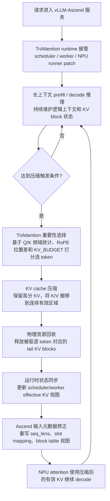

# TriAttention vLLM-Ascend 版本开发总结

>
> 当前版本基线：`tri_zxj_version0615`，最新提交 `a9c07ef Add TriAttention Ascend docs`。

## 1. 总体定位

原始 TriAttention 主要提供基于三角频域打分的 KV cache 压缩能力，用于在长上下文推理中减少 KV cache 占用。当前版本在此基础上完成了面向 vLLM-Ascend 服务化推理的工程化开发，使算法不仅能在理论/离线路径上工作，还能在 Ascend NPU、vLLM 调度器、多请求并发、块式 KV cache、压缩后物理回收等真实生产路径中稳定运行。

一句话概括：

> 当前版本把原始 TriAttention 的“KV 重要性选择算法”扩展成了一个可在 vLLM-Ascend 长上下文服务中运行的完整 runtime：包含 NPU 接入、压缩触发、打分选择、KV 搬移、物理 block 回收、并发请求同步、输入元数据修正、性能观测和回归测试。

## 2. 当前执行流程图

下面流程图按大的核心步骤描述当前 vLLM-Ascend 版本中 TriAttention 的执行闭环。

算法核心可以概括为四步：

1. 离线或预先生成模型相关的 Q/K 频域统计，用于描述不同层、不同 KV head 的长期注意力偏好。
2. 在线触发压缩时，从 paged KV cache 中读取候选 K，并结合 RoPE 频率、位置差和频域统计计算 token 重要性分数。
3. 根据 `KV_BUDGET` 选出每个请求需要保留的 KV token，支持 per-head 或 shared 选择语义。
4. 将保留 KV 搬移到连续有效区域，并把被驱逐 token 对应的 tail blocks 释放给 vLLM-Ascend 继续复用。

## 3. 核心开发点

| 模块方向 | 主要改动 | 作用 |
|---|---|---|
| vLLM-Ascend 接入 | 增加 NPUWorker / NPUModelRunner 运行时 patch，安装 TriAttention model runner proxy | 让 TriAttention 能接入 vLLM-Ascend 的执行链路，在服务化推理中自动触发压缩 |
| Ascend 输入元数据开发 | patch `seq_lens`、`seq_lens_np`、slot mapping、block table 等输入准备逻辑 | 保证压缩后 NPU attention 只读取有效 KV，避免仍按原始长上下文读取导致重复 token、越界或错误结果 |
| Ascend scoring 后端 | 在 Ascend 上使用 PyTorch/torch_npu scoring，保留 CUDA Triton 路径 | 解决 CUDA Triton kernel 不能直接用于 NPU 的问题，使 sparse TriAttention 打分可在 Ascend 上运行 |
| KV 压缩执行 | 支持 vLLM combined cache 和 vLLM-Ascend split cache 的原地 KV compaction | 将被选中的 KV token 重新排列到有效前缀，形成压缩后的 KV cache 视图 |
| 物理 block 回收 | 增加 tail block reclaim、block table tail 清理、worker/engine 同步 | 让“逻辑压缩”真正转化为 KV cache 使用量下降，释放可复用物理块 |
| 多请求并发稳定性 | 增加 batch row 映射、有效长度 override、scheduler/worker 状态同步和并发压缩限流 | 支持 batch size / 多并发请求下稳定压缩，避免不同请求之间状态错位 |
| KV 驱逐 bug 修复 | 移植旧版本中已验证的 eviction 修复，包括跨进程事件传递和 boundary OOB clamp | 修复压缩事件无法传回 scheduler、压缩后 block 回收不生效、decode 边界越界等关键问题 |
| 压缩触发策略 | 增加 prefill/decode 阶段判断、reclaim 阈值、首轮 decode 触发、每 step 最大压缩数 | 控制压缩时机，减少无效压缩和热路径开销，兼顾性能与稳定性 |
| 精度保护 | 默认倾向 sparse stats TriAttention 选择，增加 fast-recency accuracy guard | 避免长上下文下误用纯最近邻策略造成精度掉点 |
| 性能优化 | 增加 zero-copy recency、score layer cap、prefill 压缩延迟、热路径日志开关 | 降低 NPU 上 scoring、KV 搬移、日志输出对 TPOT 的影响 |
| 可观测性 | 增加 execution path log、core trace、selector debug、phase/e2e/perf profile | 能判断请求是否真正进入 TriAttention core、scoring 是否启用、压缩是否生效 |
| 测试与文档 | 增加 Ascend runtime 单测、vLLM-Ascend 文档、scoring 精度验证脚本 | 支撑后续回归验证和部署复现 |

## 4. 关键开发内容展开

### 4.1 vLLM-Ascend 运行时接入

原始版本的 TriAttention 主要面向 vLLM/CUDA 或离线算法路径。当前版本增加了 vLLM-Ascend runtime patch，主要包括：

- 在 vLLM plugin 激活时安装 scheduler / worker patch。
- 在 `vllm_ascend.worker.worker.NPUWorker` 创建 NPU model runner 后安装 TriAttention runner proxy。
- 将压缩逻辑插入 vLLM-Ascend 的 `execute_model` / `sample_tokens` / scheduler update 等关键路径。
- 支持 Ascend V1/V2 不同 input preparation 形态。

作用：

- TriAttention 不再只是独立算法，而是能跟随 vLLM-Ascend 服务请求自动运行。
- 用户通过环境变量即可启用/关闭和调整压缩参数。

### 4.2 NPU attention metadata 开发

压缩 KV 后，如果只移动 KV tensor，而不修改 vLLM-Ascend 的输入元数据，NPU attention 仍会认为当前请求拥有原始长上下文长度。这样会导致 attention 读取已经被压缩/回收的旧位置，表现为重复 token、输出异常、越界或压缩不生效。

当前版本完成了这些开发：

- 将压缩后的有效长度写入 NPU `seq_lens` 和 CPU `seq_lens_np`。
- 根据有效 KV 长度重建 slot mapping。
- 对 vLLM V1 backend 和 vLLM-Ascend backend 分别做 input patch。
- 对多请求 batch 下的每一行维护独立 effective base / effective seq len。
- 在 block 边界处 clamp slot position 和 seq_len，防止 worker 本地 block table 尚未同步时发生 OOB。

作用：

- 保证模型 forward 看到的是“压缩后的有效 KV 视图”。
- 保证 scheduler 仍保留逻辑上下文长度，而 worker/NPU attention 使用压缩后的物理视图。

### 4.3 Ascend scoring 后端开发

原始 TriAttention 的 vLLM scoring 路径依赖 CUDA Triton kernel。Ascend NPU 无法直接使用 CUDA Triton，因此当前版本增加了 Ascend 友好的 scoring 策略：

- `TRIATTN_RUNTIME_SCORING_BACKEND=auto` 时，CUDA 使用 Triton，Ascend 使用 PyTorch/torch_npu。
- Ascend scoring 临时将 key、频率统计、RoPE 频率等提升到 float32，KV cache 本身仍保持模型 dtype。
- 支持 per-head sparse scoring，尽量对齐 HF/R-KV 的选择语义。
- 支持 tensor parallel stats slicing 和 GQA head 映射。
- 支持 score layer cap，默认在 Ascend 上限制 scoring 层数，降低 TPOT 开销。

作用：

- 让 TriAttention 的核心 sparse scoring 能在 Ascend 上运行。
- 在保证选择语义尽量一致的前提下，控制 NPU 上 PyTorch eager 多 kernel scoring 的额外开销。

### 4.4 KV compaction 与物理 block 回收

当前版本不仅做“逻辑选择”，还实现了压缩后的实际 KV 搬移和 block 回收：

- 支持 vLLM CUDA-style combined KV cache：`[2, num_blocks, block_size, num_kv_heads, head_dim]`。
- 支持 vLLM-Ascend split KV cache：`(k_cache, v_cache)`。
- 支持 shared indices 和 per-head indices 两种 compaction。
- 将保留 token 搬移到前缀连续区域。
- 根据压缩后的有效长度推导可回收 tail blocks。
- 清理 block table tail，避免后续 attention 看到陈旧 block。
- 同步 scheduler 和 worker 侧的 KV allocation 状态。

作用：

- 使 KV usage 真正下降，而不是只在逻辑上“假装压缩”。
- 释放出来的 block 可以被后续 decode 或其他并发请求复用。

### 4.5 KV 驱逐关键 bug 修复

当前 `tri_zxj_version0615` 分支最后合入了旧版本 `other_code_sa/tri_xj` 中已验证的 KV eviction 修复，主要解决两个关键 bug 群：

1. 跨进程压缩事件传递链路断裂。
   - vLLM-Ascend V1 async 路径中，worker 端生成的 compression events 原先无法可靠传回 engine_core。
   - 当前版本通过 `ModelRunnerOutput.kv_connector_output.kv_cache_events` 这个 declared dataclass 字段携带事件，避免普通 `setattr` 在 cloudpickle 跨进程时丢失。
   - engine_core 端按三优先级读取事件：`kv_cache_events` > `model_runner_output.triattention_compression_events` > `scheduler_output.triattention_compression_events`。

2. 压缩边界处 worker block table 容量越界。
   - 压缩后 effective base 会沿压缩锚点继续递增，但 worker 本地 block table 可能还没同步到新分配 block。
   - 当前版本读取 worker 当前 block table 容量，并对 slot position 和 seq_len 做 capacity clamp。
   - 避免在 block 边界 decode 时写入超出 worker 当前可见容量的位置。

作用：

- 让压缩事件能稳定回传 scheduler，并驱动真正的 block 释放。
- 修复长上下文连续 decode 时的边界 OOB 和请求崩溃问题。
- 使“压缩 + 回收 + 后续继续 decode”成为闭环。

### 4.6 并发与批处理稳定性

vLLM-Ascend 服务化场景的难点不是单请求，而是多请求 batch 下每个请求的长度、压缩状态、block table 行号、slot mapping 都可能不同。当前版本围绕并发做了大量开发：

- 多请求 effective override，按 request / row 维护压缩后的 effective seq len。
- batch row 变化后重建 Ascend V1 slot mapping。
- 清理 stale decode block append。
- 防止 scheduler rollback 导致 effective base 回退。
- 保留 decode slack 和 block growth，避免压缩后新 token 无法继续追加。
- 对每个 model step 限制最大压缩请求数，避免高并发下多个请求同时触发昂贵 scoring/compaction。
- 对 graph mode 做 guard，避免不兼容路径破坏 vLLM-Ascend 执行模式。

作用：

- 支持 batch size 大于 1 的服务化并发。
- 减少压缩动作对整批 decode TPOT 的尖峰影响。
- 避免请求之间状态串扰。

### 4.7 prefill/decode 阶段压缩策略

长上下文请求通常包含大 prefill 和持续 decode。当前版本对压缩触发进行了阶段化控制：

- 默认 Ascend 上延迟 prefill compression，等完整 prompt prefill 完成后再做首次压缩。
- 支持配置 prefill 阶段最大压缩次数。
- 支持最小 reclaim blocks 阈值，只有能释放足够 block 时才压缩。
- 支持首个 eligible decode boundary 触发压缩。
- 支持 `KV_BUDGET`、`DIVIDE_LENGTH`、`WINDOW_SIZE` 等预算和粒度控制。

作用：

- 避免 prefill 分块过程中频繁压缩造成额外开销和状态不稳定。
- 使首次压缩更容易发生在收益明确的边界。
- 降低“压缩太频繁但释放很少”的无效成本。

### 4.8 fast recency 与精度保护

当前版本保留了 fast recency-only 路径，用于低开销诊断或极简压缩场景，但默认增加了精度保护：

- `FAST_RECENCY_ONLY` 可保留最近 `KV_BUDGET` 个 token。
- `FAST_RECENCY_ACCURACY_GUARD` 默认开启：当 sparse stats 可用时，优先回到真正的 TriAttention sparse scoring。
- 长上下文下可启用 recency guard，避免误用纯最近邻策略。
- 支持 zero-copy recency tail remap，在预算 block 对齐时减少 KV 搬移。

作用：

- 保留一个快速诊断路径，便于判断 runtime 是否接入成功。
- 正式长上下文精度测试中，避免纯 recency 导致精度掉点。

### 4.9 日志、profiling 与可验证性

为了定位 Ascend 服务化路径中的问题，当前版本增加了多层观测能力：

- runtime logging master switch：性能测试时可以一键关闭普通日志。
- execution path markers：判断是否进入 runner、worker hook、group pipeline、selector scoring。
- core trace / selector debug：需要时展开核心压缩路径。
- perf profile / e2e profile / phase profile：拆分调度、模型 forward、scoring、compaction 等耗时。
- build id 日志：避免线上容器加载旧版本源码。

作用：

- 能证明一次请求是否真正进入 TriAttention core。
- 能区分“未触发压缩”“进入 pure recency”“进入 sparse scoring”“压缩事件未回传”等不同问题。
- 支撑 TPOT、TTFT 和压缩开销分析。

### 4.10 测试与文档建设

当前版本补充了针对 Ascend runtime 的单元测试和部署文档：

- Ascend 默认配置测试。
- graph mode guard 测试。
- input patch / slot mapping / seq_len override 测试。
- prefill phase 测试。
- runner output bridge 跨进程事件测试。
- worker reclaim sync 测试。
- zero-copy tail remap 测试。
- runtime logging control 测试。
- perf / phase profile 测试。
- vLLM-Ascend 部署文档和 scoring 精度验证脚本。

作用：

- 将之前依赖手工复现的问题固化为可回归测试。
- 降低后续调参、模型支持、vLLM-Ascend 版本升级时的回归风险。

## 5. 当前版本相对原始版本的核心价值

### 5.1 从算法原型到 Ascend 可运行 runtime

原始版本强调 TriAttention 的压缩算法本身；当前版本解决了算法落到 vLLM-Ascend 服务化推理时必须面对的工程问题，包括 NPU runner 接入、attention metadata 修正、KV cache layout 兼容、scheduler/worker 状态同步等。

### 5.2 从逻辑压缩到真实 KV usage 下降

当前版本不仅选择保留哪些 token，还完成了 KV cache 原地搬移、tail block reclaim、block table 清理和 allocation 同步，因此可以真正降低 KV cache 使用量，并提升高并发长上下文下的可服务请求数。

### 5.3 从单请求验证到多请求并发稳定

当前版本围绕 batch row、per-request effective length、scheduler rollback、decode block growth、每 step 压缩限流等做了系统开发，使算法能在 batch size > 1 和多并发服务场景下运行。

### 5.4 从黑盒运行到可观测可诊断

通过 execution path、core trace、selector debug、phase profile、E2E profile 等机制，可以明确判断压缩是否触发、走的是 sparse scoring 还是 recency、是否发生物理回收，以及具体耗时落在哪个阶段。

## 6. 修改总结

修改总结：

1. 算法层：保留 TriAttention 基于频域统计的 KV 重要性选择思想，用 `KV_BUDGET` 控制保留 token 数。
2. 系统层：将算法接入 vLLM-Ascend runtime，支持 NPUWorker、NPUModelRunner、scheduler/worker 协同。
3. 数据结构层：支持 Ascend split KV cache、block table、slot mapping、seq_lens 等执行元数据。
4. 内存层：实现压缩后的物理 block 回收，使 KV usage 真正下降。
5. 并发层：支持多请求 batch 下的 per-request effective KV 视图和状态同步。
6. 性能层：增加 Ascend PyTorch/torch_npu scoring、layer cap、prefill 延迟压缩、zero-copy recency、压缩限流等优化。
7. 稳定性层：修复跨进程事件传递、block 边界 OOB、scheduler/worker 状态不同步等关键 bug。
8. 工程层：增加日志、profiling、测试和部署文档，形成可复现、可调优、可回归的版本。

## 7. 当前仍需注意的边界

- sparse stats 必须与模型匹配；不同模型不应盲目共用同一个 stats 文件。
- Ascend 当前 scoring 仍是 PyTorch/torch_npu eager 多 kernel 路径，后续若要进一步提升 TPOT，融合 scoring kernel 是重要优化方向。
- prefix caching 与压缩 KV 语义不兼容，部署时需要关闭。
- fast recency-only 更适合诊断或性能对照，长上下文精度测试应优先使用 sparse stats TriAttention。
- 新模型如 Qwen3.5-27B 需要先确认 vLLM-Ascend baseline 支持，并生成该模型专用 stats 后再评估精度和性能收益。
